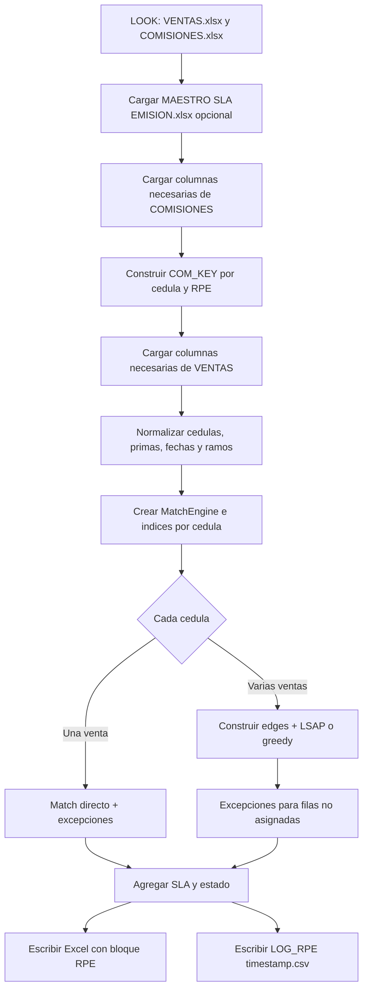

# Revision tecnica y funcional comparativa

## `BG_AUTOMATIZACION_FINAL.py` frente a `bg_rpe_automatizacion_6865.py`

**Fecha de revision:** 2026-08-20  
**Alcance:** analisis estatico del nuevo script, comparacion con la version anterior y revision de los archivos visibles del proyecto.  
**Ejecucion funcional:** no realizada. No se entregaron los archivos Excel y el entorno local no tiene instaladas las dependencias principales. Ambos scripts si fueron comprobados sintacticamente.

---

## Resumen ejecutivo

`BG_AUTOMATIZACION_FINAL.py` conserva el objetivo general de conciliar ventas contra comisiones/RPE mediante cedula, fecha de ingreso, ramo y prima. La version nueva reduce el tamano del modulo de **2,884 a 1,819 lineas**, pasa de una implementacion principalmente procedural a una estructura con `Config` y `MatchEngine`, y agrega una tabla maestra de SLA.

Hay mejoras reales, pero no todas son mejoras del algoritmo de conciliacion. La nueva version:

- Agrega `MAESTRO SLA EMISION.xlsx` como entrada opcional y las columnas `SLA_DIAS`, `Estado_Poliza` y `Fecha_Estado` en la salida.
- Deja de actualizar `VENTAS.xlsx` y `COMISIONES.xlsx` desde preliminares. Esto reduce el riesgo de sobrescritura de maestros, pero tambien elimina una parte del flujo operativo anterior.
- Mantiene el match directo, LSAP/greedy y las excepciones EXC_01, EXC_03 y EXC_04.
- **Elimina en la practica el emparejamiento principal + asistencia**, aunque conserva una bandera `HABILITAR_ASISTENCIA` sin uso. Esto puede reducir la cobertura de conciliacion.
- Simplifica el costo de asignacion y cambia la politica de desempates. Por ello, aun en casos sin asistencia, no se puede garantizar que asigne los mismos RPE que la version anterior.
- Cambia la representacion de EXC_01 y EXC_03: ahora incluye el RPE negativo en `RPE2`, suma su prima y su comision, mientras que la version anterior lo usaba como evidencia pero no lo exponia como asignacion principal.
- Introduce riesgos concretos en parseo de numeros, fechas, cancelaciones y seleccion de datos de una asignacion multi-venta que deben corregirse antes de declararla equivalente.

### Dictamen

La version nueva es **una refactorizacion con funcionalidad adicional, pero tambien una variante funcional del algoritmo**, no un reemplazo estrictamente compatible. Es mas ordenada y mas segura respecto a la modificacion de maestros, pero requiere una prueba de paridad y correcciones antes de migrar.

La recomendacion es:

1. No sustituir automaticamente el script anterior en produccion.
2. Corregir primero los hallazgos P0/P1 de este informe.
3. Ejecutar ambos scripts con los mismos datos anonimizados y comparar fila por fila.
4. Confirmar con negocio si la eliminacion de asistencia y la inclusion del RPE negativo en `RPE2` son cambios intencionales.

---

## Evidencia y limites

### Hechos comprobados

| Indicador | Version anterior | Version nueva |
|---|---:|---:|
| Lineas fisicas | 2,884 | 1,819 |
| Funciones AST | 102 | 51 |
| Clases | 1 (`Tbl`) | 2 (`Config`, `MatchEngine`) |
| Columnas del bloque RPE | 23 | 26 |
| Compilacion con Python local 3.13 | Exitosa | Exitosa |
| Pruebas automatizadas visibles | No | No |
| Manifiesto de dependencias visible | No | No |

En el proyecto se observan el script anterior, el nuevo script, `README.md`, `.gitignore`, `azure-pipelines.yml` y el informe previo. No se observan archivos Excel de entrada, `requirements.txt`, `pyproject.toml`, fixtures ni una suite de pruebas.

### Lo que no puede afirmarse aun

- Que la nueva version sea mas rapida en datos reales. No hay benchmark ejecutado.
- Que las diferencias de prima, cancelacion, fecha o desempate ocurran en la operacion real. Deben probarse con archivos reales o anonimizados.
- Que los cambios funcionales sean correctos desde el punto de vista contable o del negocio.
- Que el template privado de Azure DevOps instale las dependencias apropiadas. El template esta referenciado, pero no esta disponible en este workspace.

---

## Proposito funcional y flujo nuevo

### Proposito

El proceso toma un maestro de ventas, un maestro de comisiones/RPE y, opcionalmente, un maestro de SLA. Normaliza los datos, agrupa las comisiones por cedula y RPE, busca asignaciones compatibles para cada venta, aplica excepciones de negocio y genera un Excel enriquecido y un CSV de incidencias.

### Flujo end-to-end de la version nueva



### Cambio fundamental del flujo anterior

La version anterior tenia este paso antes del matching:

1. Leer `PRELIMINAR COMISIONES.xlsx` y actualizar `COMISIONES.xlsx`.
2. Leer `PRELIMINAR VENTAS.xlsx` y actualizar `VENTAS.xlsx`.
3. Leer los maestros resultantes.

La version nueva declara `ACTUALIZAR_COMISIONES = True` y `ACTUALIZAR_VENTAS = True`, pero esas banderas no se consultan en `main()` ni existe codigo de lectura de preliminares. En la practica, el nuevo flujo solo lee `VENTAS.xlsx` y `COMISIONES.xlsx`; no integra preliminares y no modifica los maestros.

Esto puede ser una mejora de seguridad si el proceso nuevo debe ser solo de conciliacion. Es una regresion funcional si la ejecucion semanal dependia de actualizar los maestros automaticamente.

---

## Entradas, salidas y efectos laterales

### Entradas

| Archivo | Uso | Obligatorio |
|---|---|---|
| `VENTAS.xlsx` | Ventas a conciliar, hoja `BASE`. | Si |
| `COMISIONES.xlsx` | RPE, primas, fechas y comisiones, hoja `Base`. | Si |
| `MAESTRO SLA EMISION.xlsx` | Producto/tipo/ramo y dias de SLA. Se busca hoja `BASE` y luego `Hoja1`. | No, el proceso continua vacio si falta |
| Preliminares de ventas/comisiones | No se leen en la version nueva. | No aplica |

Las rutas se obtienen de `RPE_LOOK` y `RPE_RESULTADOS`, pero los defaults siguen hardcodeados y ahora apuntan a una ruta con el usuario `fbazurto` (lineas 31-32). El cambio de usuario no es una mejora de despliegue; solo cambia el entorno de desarrollo embebido.

### Salidas

La salida Excel se llama:

```text
VENTAS_con_RPE_YYYYMMDD_HHMMSS.xlsx
```

El log se llama:

```text
LOG_RPE_YYYYMMDD_HHMMSS.csv
```

El uso de fecha y hora mejora la trazabilidad respecto al nombre anterior, que solo utilizaba `YYYYMMDD`. El nuevo script tambien intenta reintentar el guardado hasta cinco veces ante `PermissionError`, esperando dos segundos entre intentos.

El bloque de salida nuevo contiene 26 columnas:

- Las 23 columnas RPE que ya existian.
- `Estado_Poliza`.
- `Fecha_Estado`.
- `SLA_DIAS`.

La lista `BLOQUE_COLS` del nuevo archivo si incluye estas tres columnas; no existe el problema sugerido en una revision preliminar de que fueran omitidas de la lista.

### Efectos laterales

#### Mejora real

La version nueva no contiene `escribir_master_xlsx()`, `actualizar_archivo_comisiones()` ni `actualizar_archivo_ventas()`. Por tanto, no sobrescribe `COMISIONES.xlsx` ni `VENTAS.xlsx`. Esto elimina el riesgo mas grave identificado en la version anterior: modificacion destructiva de maestros sin backup funcional.

#### Riesgos que permanecen

- La salida se escribe directamente al nombre final; no se usa archivo temporal + `os.replace()`.
- Si dos procesos generan el mismo timestamp, el codigo intenta borrar el archivo existente antes de guardar.
- El libro de salida se reconstruye con `Workbook()`, por lo que no preserva necesariamente formulas, hojas auxiliares, macros, tablas, validaciones o estilos del libro de entrada.
- El CSV conserva cedulas, datos de venta, primas, productos y otros datos potencialmente personales.
- `warnings.filterwarnings("ignore")` continua suprimiendo advertencias globalmente.

---

## Dependencias y librerias

### Librerias externas de PyPI

| Paquete | Uso en el nuevo script | Comparacion |
|---|---|---|
| `numpy` | Valores nulos, arrays, matriz de costos y operaciones numericas. | Ya existia. |
| `pandas` | DataFrames, filtros, agrupaciones, merges y CSV. | Ya existia. |
| `openpyxl` | Lectura/escritura de Excel y estilos. | Ya existia. |
| `scipy` | `linear_sum_assignment` para LSAP. | Ya existia. |
| `python-calamine` | Lector opcional de Excel con fallback a `openpyxl`. | Ya existia; sigue siendo opcional. |
| `python-dateutil` | Se importa `relativedelta`, pero no se usa en el nuevo codigo. | Antes si se usaba para sumar meses. |

No aparece una nueva libreria de terceros obligatoria. La novedad principal es el archivo de datos `MAESTRO SLA EMISION.xlsx`, no una dependencia Python.

### Libreria estandar agregada o usada de forma distinta

- `typing`: anotaciones `Dict`, `List`, `Optional`, `Tuple`, `Any`.
- `functools.lru_cache`: cache de conversiones de serial Excel y suma de meses.
- `collections.defaultdict`: indices internos por cedula y base.

Todas forman parte de Python y no requieren instalacion.

### Imports sin uso detectados

En la version nueva se observan:

- `Union` importado desde `typing`, sin referencias.
- `relativedelta` importado, sin referencias.
- `openpyxl` como modulo, aunque sus simbolos importados directamente si se utilizan.
- `self._cache` creado en `MatchEngine`, sin uso posterior.
- `_com_by_base` construido en `MatchEngine`, sin uso posterior.

### Dependencias privadas

No se encontraron imports de modulos Python privados, paquetes corporativos ni SDKs internos en el script. Las clases, funciones y mapas son codigo local del archivo.

La canalizacion sigue dependiendo de un repositorio privado de templates de Azure DevOps y de grupos de variables corporativos. Esa dependencia es de CI/CD, no del algoritmo Python, y no pudo auditarse con los archivos disponibles.

### Estado del entorno local

El entorno local utilizado para la revision tiene `python-dateutil`, pero no tiene instalados `numpy`, `pandas`, `openpyxl`, `scipy` ni `python-calamine`. Sin un manifiesto de dependencias no existe una forma reproducible de preparar el entorno solo a partir del proyecto.

---

## Lectura y normalizacion de datos

### Lectura Excel

El nuevo script concentra la lectura en:

- `read_excel_fast()`.
- `read_sheet_to_df()`.

El lector intenta Calamine y luego `openpyxl` en modo `read_only`. La funcion `read_sheet_to_df()` solicita solo las posiciones de columnas necesarias, lo que es una buena decision de interfaz.

Sin embargo, cuando Calamine esta disponible, `read_excel_fast()` ejecuta `ws.to_python(skip_empty_area=False)` sobre la hoja completa, sin respetar realmente `n_rows` ni `max_cols` en ese camino. Esto conserva el problema de memoria de la version anterior: leer solo algunas columnas desde el DataFrame no evita haber cargado la hoja completa primero.

Ademas, en el fallback `openpyxl`, `detectar_header_ventas()` vuelve a leer el libro para cada fila candidata entre la 1 y la 15. Si Calamine no esta instalado, esto puede multiplicar el costo de deteccion de encabezados.

### Fechas

`parse_fecha_fast()` mantiene soporte para:

- Objetos `date`, `datetime` y `Timestamp`.
- Seriales Excel entre 20,000 y 60,000.
- Fechas numericas `YYYYMMDD`.
- Cadenas delegadas a `pd.to_datetime()`.

Pero la version anterior tenia `FECHA_DIA_PRIMERO = True` y un parser explicito para `DD/MM/YYYY`, `DD-MM-YYYY`, `DD.MM.YYYY`, fechas con hora e ISO. La nueva no tiene una bandera equivalente ni pasa `dayfirst=True` a `pd.to_datetime()`.

Esto es un riesgo para datos de Ecuador. Una cadena ambigua como `08/05/2026` puede interpretarse de forma diferente dependiendo de la version de pandas y del formato inferido. No debe considerarse una optimizacion segura hasta probar formatos reales.

### Numeros y primas

`to_num_fast()` es mas corto, pero perdio parte de la logica de la version anterior. Ejemplos de comportamiento estatico:

| Texto | Version anterior `to_num_scalar` | Nueva `to_num_fast` | Riesgo |
|---|---:|---:|---|
| `1,000` | `1000` | `1.0` | Interpreta miles como decimal. |
| `1.000` | `1000` | `1.0` | Interpreta miles como decimal. |
| `1,50` | `1.5` | `1.5` | Igual. |
| `1.000,50` | `1000.5` | `1000.5` | Igual en este caso. |

Para primas, esta diferencia puede cambiar candidatos, tolerancias, costos y resultados. Es un hallazgo P0 si las exportaciones contienen importes de miles con un solo separador.

### Cedulas y RPE

La limpieza de cedulas se mantiene razonablemente equivalente. En cambio, la version nueva no tiene una funcion equivalente a `_clean_rpe()` de la version anterior. `cargar_comisiones()` copia el valor de RPE sin normalizarlo.

Si Calamine entrega componentes numericos como `1.0-437140.0-0.0`, la version anterior lo convertia a `1-437140-0`; la nueva puede conservar decimales, afectar `rpe_base()` y dificultar la deteccion de cancelaciones o la comparacion de identificadores.

---

## Algoritmo de conciliacion

### Flujo comun

Ambas versiones comparten estas ideas:

1. Convertir cedula a diez digitos.
2. Convertir fechas y primas.
3. Convertir el ramo a un codigo fijo.
4. Agrupar comisiones por `(cedula10, rpe)`.
5. Considerar RPE positivos, fecha de emision dentro de la ventana y prima dentro de tolerancia.
6. Resolver grupos con LSAP o greedy.
7. Aplicar excepciones posteriores.

Las tolerancias principales siguen siendo:

```text
Prima: 3% o 10 unidades absolutas
Ventana: ingreso hasta ingreso + 11 meses
Cancelacion: 0.5% o 2 unidades absolutas
Ajuste posterior: hasta 10% o 150 unidades, con negativo dentro de 45 dias
Cancelacion posterior: hasta 365 dias
Emision previa: 1 dia antes del ingreso
```

### Diferencias algoritmicas reales

#### 1. Se elimina el par principal + asistencia

La version anterior tenia `try_pair_asistencia()` y lo invocaba desde `match_one_row()` para combinar un RPE principal y un RPE de asistencia cuando la suma conciliaba.

En el nuevo script:

- Existe `Config.HABILITAR_ASISTENCIA = True`.
- No existe `try_pair_asistencia()`.
- No aparece una llamada equivalente en `_match_single()` ni `_match_multi()`.
- `MAX_DIAS_ASISTENCIA`, `ASISTENCIA_MAX_FRAC`, `MAIN_TOP` y `OTHER_TOP` quedan sin un flujo que los use.

Esto no es una simple refactorizacion. Una venta que solo conciliaba mediante el par principal + asistencia puede quedar ahora como `ROJO_SIN_RPE` o `No asignado`.

#### 2. El costo de asignacion se simplifica

La version anterior construia un costo compuesto que incluia:

```text
absd_cent * 1e8
+ absd * 1e5
+ older_claims_for_rpe * PRIORIDAD_ANTIGUEDAD_COST
+ days_gap * 1e2
+ cand_deg * 1e-1
+ emis_mod * 1e-6
```

La nueva version usa en `_match_multi()`:

```text
cost = abs_diff * 1e8 + days_gap * 1e2
```

Se pierden, por tanto, las prioridades explicitas de antiguedad, grado del candidato y desempate por emision. El solucionador sigue siendo LSAP cuando aplica, pero resuelve otra funcion de costo. En grupos ambiguos puede asignar RPE distintos aun si todos cumplen las mismas tolerancias.

#### 3. Cambian los limites de LSAP

| Parametro | Anterior | Nueva |
|---|---:|---:|
| Maximo de filas por cedula | 220 | 500 |
| Maximo de RPE candidatos | 1,200 | 2,000 |

Esto permite usar el algoritmo exacto en grupos mas grandes, pero aumenta el costo y la memoria potencial. En el maximo configurado, la matriz nueva puede ser de aproximadamente `500 x 2500` valores `float64`, cerca de 10 MB solo para esa matriz, sin contar DataFrames y copias. El maximo anterior era aproximadamente 2.4 MB para la matriz equivalente.

#### 4. Cambia la estrategia greedy

La version anterior ordenaba por grado de fila, grado de candidato, costo, fila y RPE. La nueva ordena por costo, fila y RPE. En grupos que superen los limites LSAP esto puede producir asignaciones diferentes y, al no incluir grados, puede ser menos cuidadosa con candidatos escasos.

#### 5. Cambia la secuencia de residuos

La version anterior, despues del solver, ordenaba las filas pendientes por cantidad de candidatos y fecha antes de aplicar reglas residuales. La nueva recorre las filas del grupo en su orden actual. Esto puede cambiar quien recibe primero un RPE cuando hay competencia entre filas no asignadas.

#### 6. Cambia el resultado de EXC_01 y EXC_03

En la version anterior, el RPE negativo servia para demostrar el ajuste/cancelacion, pero el resultado devolvia principalmente el RPE positivo:

- `RPE1`: positivo.
- `RPE2`: `None`.
- `prima2`: `NaN`.
- `multi_n`: 1.
- Comision: la del positivo.

En la version nueva, `_try_ajuste_posterior()` y `_try_cancelado_posterior()` devuelven:

- `RPE1`: positivo.
- `RPE2`: negativo.
- `prima2`: prima negativa.
- `multi_n`: 2.
- Comision: suma de positivo y negativo.

Puede ser una mejora de trazabilidad, pero cambia importes y significado de la salida. Tambien alimenta `Fecha_Estado` desde ese `RPE2`. Debe ser aprobado por negocio y comparado con reportes que consuman `cantidad_rpe_asignados` o `comision_total_rpe`.

#### 7. Cambia la deteccion de cancelaciones

La version anterior comparaba cada RPE positivo con candidatos negativos posteriores del mismo `base` y seleccionaba un negativo posterior concreto.

La nueva primero agrega los negativos por `(cedula10, base)` usando:

```python
emision = min(emision)
suma_prima = abs(min(suma_prima))
```

Esto puede combinar la fecha del negativo mas temprano con el importe del negativo mas grande, aunque pertenezcan a filas distintas. Con multiples negativos por base, puede marcar cancelaciones incorrectamente o dejar de marcar una cancelacion valida.

#### 8. Posible error al materializar una asignacion multi-venta

En `_match_multi()`, despues de obtener un RPE asignado a una fila, la version nueva recupera el detalle con:

```python
match_row = edges[edges['rpe'] == rpe].iloc[0]
```

La busqueda no incluye `row_id`. Si el mismo RPE es candidato para varias filas, se puede tomar el detalle de otra fila: fecha, prima, vigencia o comision pueden quedar asociadas incorrectamente al `row_id` que realmente gano el solver.

La version anterior hacia el merge por `row_id` y `rpe`, que es la forma correcta. Este hallazgo debe corregirse antes de usar la nueva version.

### Conclusion sobre el algoritmo

El algoritmo **si cambio**. Conserva la familia de solucion, las tolerancias base y las excepciones principales, pero no es equivalente por estas causas:

1. Se elimino asistencia.
2. Se cambio la funcion de costo.
3. Se cambio el greedy.
4. Se cambio el orden de residuos.
5. Se cambio la deteccion de cancelacion.
6. Se cambio la representacion de ajustes y cancelaciones.
7. Hay una posible desalineacion de detalle en grupos con multiples ventas.

---

## SLA y nuevas salidas

### Carga del SLA

`cargar_sla_maestro()` lee un archivo nuevo y busca columnas de producto, tipo, ramo y SLA. Si no identifica algunas columnas, usa posiciones fijas como respaldo. Tambien intenta leer `Hoja1` como estructura alternativa.

La funcion de consulta aplica varios niveles de fallback:

1. Producto + ramo exactos.
2. Producto + ramo en ramo o tipo.
3. Producto sin ramo.
4. Coincidencia parcial de producto.
5. Ramo.
6. Tipo de producto.

Esto es flexible, pero puede devolver el primer SLA disponible para un producto ambiguo y ocultar errores de catalogo. Se recomienda devolver tambien el nivel de coincidencia y una bandera de confianza.

Hay una inconsistencia que debe aclararse: el comentario de carga habla de una estructura `Hoja2`, mientras `Config.SHEET_SLA` vale `BASE` y el respaldo intenta `Hoja1`, no `Hoja2`. Si el archivo real tiene solo `Hoja2`, el SLA quedara vacio.

### Estado de poliza

La nueva salida deriva:

```text
EXC_03 -> INACTIVO
EXC_01 -> ACTIVO
EXC_04 -> EMISION ANTES DE INGRESO
Sin excepcion -> ACTIVO
```

`Fecha_Estado` toma la fecha de emision del RPE que aparece en `RPE2`. Por ello esta nueva columna depende directamente del cambio de representar el RPE negativo de EXC_01/EXC_03 como segundo RPE.

---

## Rendimiento y grado de optimizacion

### Mejoras tecnicas potenciales

| Cambio | Evaluacion |
|---|---|
| `Config` centralizado | Mejora de organizacion, no una mejora de velocidad por si misma. |
| `MatchEngine` | Mejora de encapsulacion y testabilidad. |
| `lru_cache` | Puede ayudar si se repiten seriales Excel o fechas; el beneficio real depende de los datos. |
| Indice por cedula | Util, pero la version anterior ya construia `com_by_ced` y `ven_by_ced`; no es una mejora asintotica demostrada. |
| Lectura por columnas | Buena intencion; con Calamine la hoja completa sigue cargandose primero. |
| LSAP 500/2000 | Puede reducir uso de greedy, pero aumenta costo/memoria. |
| Retry de guardado | Mejora operativa ante archivos bloqueados. |
| SLA | Funcionalidad nueva, no optimizacion. |

### Costos nuevos o posibles regresiones de rendimiento

- `get_sla_for_producto_ramo()` filtra el DataFrame y puede recorrer filas para cada venta. No hay indice por producto/ramo ni cache de consultas.
- Para una cedula con una sola venta, la version anterior tenia un fast path basado en arrays y costo equivalente al solver. La nueva hace filtros y ordenamiento de DataFrame por cada fila; no se puede asumir que sea mas rapida.
- `_com_by_base` y `self._cache` se construyen o reservan, pero no aportan rendimiento porque no se consultan.
- El producto cartesiano de ventas contra RPE dentro de una cedula sigue existiendo en `_match_multi()`.
- Con Calamine, `read_excel_fast()` sigue materializando hojas completas; `n_rows` y `max_cols` no limitan esa lectura.
- Sin Calamine, la deteccion del encabezado puede releer el archivo hasta 15 veces.
- El limite LSAP mas alto puede aumentar de forma importante el costo de grupos grandes.

### Juicio de optimizacion

No existe evidencia suficiente para afirmar que la version nueva sea `10%`, `20%` o `30%` mas rapida. Esa estimacion seria especulativa sin archivos de referencia y mediciones.

El juicio tecnico es:

- **Mejor mantenibilidad:** si.
- **Mejor seguridad sobre maestros:** si, porque no los modifica.
- **Mejor velocidad garantizada:** no demostrada.
- **Mejor escalabilidad garantizada:** no; el LSAP mas grande y los cruces completos pueden empeorar casos extremos.
- **Mejor funcionalidad:** si agrega SLA y estado, pero pierde asistencia y cambia la semantica de excepciones.

Las metricas que deben medirse por corrida son:

- Filas de ventas y comisiones.
- Numero de cedulas.
- Maximo de ventas y candidatos por cedula.
- Numero de aristas antes y despues de filtros.
- Cantidad de grupos resueltos por LSAP y greedy.
- Tiempo de lectura, normalizacion, SLA, matching y escritura.
- Memoria maxima.
- Matches directos, asistencia, EXC_01, EXC_03, EXC_04 y sin RPE.

---

## Robustez, seguridad y calidad

### Mejoras reales respecto a la version anterior

1. No modifica los maestros.
2. Tiene una estructura `MatchEngine` mas facil de aislar en pruebas.
3. Centraliza configuracion en `Config`.
4. Usa anotaciones de tipo en las funciones principales.
5. Tiene reintentos ante bloqueo del archivo de salida.
6. Genera nombres de salida con hora, reduciendo colisiones normales del mismo dia.

### Problemas nuevos o agravados

1. Usa 13 `except:` sin tipo, mas permisivos que los `except Exception` del script anterior. Pueden capturar interrupciones del proceso y ocultar errores de datos.
2. `to_num_fast()` puede interpretar miles como decimales.
3. `parse_fecha_fast()` no explicita dia primero.
4. No normaliza RPE como la version anterior.
5. La deteccion de cancelacion agrega negativos de forma potencialmente incorrecta.
6. `_match_multi()` puede tomar el detalle de otra fila por no filtrar por `row_id`.
7. Las banderas `ACTUALIZAR_COMISIONES`, `ACTUALIZAR_VENTAS` y `HABILITAR_ASISTENCIA` son enganosas porque no gobiernan el flujo real.
8. La configuracion del SLA tiene comentarios y hojas esperadas inconsistentes.
9. La escritura nueva no aplica los formatos numericos del bloque que si aplicaba la anterior para importes, porcentaje y cantidad.
10. Sigue ignorando todos los warnings.

### Robustez que se perdio frente al anterior

La version anterior tenia capacidades que no aparecen en la nueva:

- Deteccion de hojas por contenido.
- Deteccion mas robusta de encabezados en preliminares.
- Validacion de mapeo de ventas con porcentajes de columnas esenciales.
- Eliminacion de filas mal cargadas del maestro de ventas.
- Limpieza de RPE con componentes numericos y decimales.
- Actualizacion controlada de maestros desde preliminares.
- Tolerancia explicita `FECHA_DIA_PRIMERO`.
- Costo de asignacion con prioridad de antiguedad, grados y desempates mas detallados.

Algunas de estas capacidades ya no eran necesarias si el nuevo contrato es exclusivamente leer dos maestros fijos. Esa decision debe documentarse, no asumirse.

---

## Matriz comparativa

| Capacidad | Version anterior | Version nueva | Evaluacion |
|---|---|---|---|
| Conciliar ventas contra RPE | Si | Si | Misma finalidad. |
| Actualizar maestros desde preliminares | Si | No | Perdida funcional o cambio de alcance. |
| Modificar maestros durante la corrida | Si | No | Mejora de seguridad operativa. |
| Match directo | Si | Si | Misma forma general, distinto parseo/desempate. |
| Pair principal + asistencia | Si | No, aunque hay bandera inactiva | Regresion funcional probable. |
| LSAP | Si, hasta 220/1200 | Si, hasta 500/2000 | Mismo solver, distinto costo y escala. |
| Greedy | Grado + costo | Costo + fila + RPE | Cambia asignaciones grandes. |
| EXC_01, EXC_03, EXC_04 | Si | Si | Semantica de salida diferente. |
| EXC_02 | Declarada, no implementada | Declarada, no implementada | Sin cambio. |
| Deteccion cancelaciones | Por pares de filas | Agregacion de negativos | Riesgo de regresion. |
| Limpieza de RPE | Robusta | No equivalente | Riesgo con valores numericos/decimales. |
| Parseo dia primero | Configurable/explicito | Depende de pandas | Riesgo de fecha ambigua. |
| SLA | No | Si | Funcionalidad nueva. |
| Estado de poliza | No | Si | Funcionalidad nueva. |
| Nombre de salida | Solo fecha | Fecha + hora | Mejora de trazabilidad, no atomica. |
| Retry al guardar | No | Si, PermissionError | Mejora operativa parcial. |
| Preservacion del libro Excel | Reconstruye salida | Reconstruye salida | Riesgo compartido. |
| Type hints | No | Parciales | Mejora de mantenibilidad. |
| Tests visibles | No | No | Sin mejora. |
| Dependencias versionadas | No | No | Sin mejora. |

---

## Mejoras priorizadas

### P0: corregir antes de comparar resultados

1. **Corregir la asociacion multi-venta.** Cambiar la recuperacion del detalle a una seleccion por `row_id` y `rpe`, o hacer un merge exacto como en la version anterior.
2. **Restaurar `try_pair_asistencia()`** si sigue siendo parte del negocio, o eliminar formalmente la bandera y actualizar la especificacion. Agregar casos de prueba que demuestren la diferencia.
3. **Restaurar la interpretacion de numeros.** Reutilizar la logica probada de `to_num_scalar()` o separar un parser de primas y comisiones con reglas documentadas.
4. **Restaurar parseo explicito de fechas.** Añadir `FECHA_DIA_PRIMERO` y formatos definidos; evitar depender de inferencia de pandas para fechas ambiguas.
5. **Validar paridad R/Python y anterior/nueva** con un dataset anonimo representativo antes de elegir version.

### P1: corregir integridad del dominio

1. Rehacer la deteccion de cancelacion a nivel de fila: cada positivo debe compararse con un negativo concreto, conservando fecha e importe del mismo registro.
2. Reincorporar `_clean_rpe()` o una normalizacion equivalente antes de construir `rpe_code` y `base`.
3. Definir si EXC_01 y EXC_03 deben exponer el negativo en `RPE2` y sumar su comision. Validar consumidores de Power BI y reportes.
4. Revisar `prima_conj` y conservar el fallback cuando el valor de conjunto sea cero pero exista suma de primas reales.
5. Validar `col_finv` antes de incluirlo en `cols_needed` y reemplazar expresiones `find_col(...) or fallback` por `is not None`.
6. Decidir si las banderas de actualizacion se eliminan o si se implementa nuevamente el flujo de preliminares.
7. Corregir la hoja SLA esperada (`BASE`, `Hoja1` o `Hoja2`) y validar el esquema antes de procesar.

### P2: operacion y observabilidad

1. Reemplazar `except:` por excepciones especificas y registrar el motivo de cada fallback.
2. Sustituir `warnings.filterwarnings("ignore")` por filtros precisos y logging estructurado.
3. Crear una salida temporal y publicar con `os.replace()`; nunca borrar silenciosamente un resultado previo del mismo timestamp.
4. Aplicar formatos numericos a las nuevas salidas de importe, porcentaje, cantidad y SLA.
5. Indexar el SLA por producto, tipo y ramo; cachear consultas repetidas.
6. Eliminar `_com_by_base` y `self._cache` si no se van a utilizar, o usarlos para las reglas de cancelacion/SLA.
7. Mover rutas, nombres de hojas y tolerancias a configuracion validada; almacenar la configuracion junto a cada corrida.

### P3: mantenibilidad y pruebas

1. Crear `requirements.txt` o `pyproject.toml` con versiones validadas.
2. Extraer normalizacion, lectura Excel, dominio de match, SLA y reporting a modulos separados.
3. Crear pruebas unitarias para fechas, numeros, cedulas, RPE, ramos, SLA y cancelaciones.
4. Crear pruebas golden para match directo, asistencia, grupos ambiguos, EXC_01, EXC_03, EXC_04 y ramo no mapeado.
5. Crear un benchmark con volumen pequeno, medio y maximo esperado.
6. Documentar si el nuevo contrato ya no actualiza maestros y quien es responsable de cargar los preliminares.

---

## Plan de validacion recomendado

### Conjunto minimo de casos

| Caso | Resultado que debe compararse |
|---|---|
| Venta con match directo exacto | RPE, prima, comision y fecha. |
| Dos ventas de una cedula con candidatos cruzados | Asignacion global y detalle correcto por `row_id`. |
| Venta que requiere asistencia | Debe existir en la nueva solo si se restaura la regla; actualmente se espera diferencia. |
| `prima_conj` cero con primas individuales | Verificar fallback y monto final. |
| Varias cancelaciones del mismo base | Verificar que fecha e importe pertenezcan al mismo negativo. |
| Importes `1,000`, `1.000`, `1,000.50` y `1.000,50` | Confirmar interpretacion por contrato regional. |
| Fechas `08/05/2026`, ISO y serial Excel | Confirmar dia/mes sin inversion. |
| RPE con valores numericos decimales | Confirmar normalizacion y cancelacion. |
| Producto/ramo con SLA exacto y ambiguo | Confirmar dias y nivel de confianza. |
| Archivo SLA ausente o con hoja distinta | Confirmar si debe continuar o fallar. |
| Excel abierto durante escritura | Confirmar reintento y no perdida de salida anterior. |

### Comparacion fila a fila

Para cada venta se deben comparar entre version anterior y nueva:

- `row_excel` y cedula.
- `RPE1`, `RPE2`, `RPE3`.
- Prima individual y prima final.
- Comision total.
- Fecha de emision y vigencia.
- `multi_n`.
- Codigo de excepcion y revision manual.
- Dictamen de color.
- Razon de no match.

Las diferencias esperadas por diseno deben separarse de las diferencias no explicadas. Una diferencia no explicada en RPE, prima o comision debe bloquear la migracion.

---

## Conclusion

`BG_AUTOMATIZACION_FINAL.py` mejora la organizacion del codigo, incorpora SLA y estado de poliza, agrega reintentos de escritura y evita la modificacion destructiva de los maestros. Esos son beneficios reales.

No obstante, la nueva version no es simplemente una version mas optima del mismo algoritmo. La eliminacion del par de asistencia, la simplificacion del costo, los nuevos limites LSAP, la nueva deteccion de cancelaciones, el cambio de representacion de EXC_01/EXC_03 y el posible error de asociacion por `row_id` cambian el resultado potencial de la conciliacion.

La respuesta tecnica a las preguntas principales es:

- **Misma funcion general:** si.
- **Mismo flujo completo:** no; ya no actualiza preliminares ni maestros.
- **Nuevas librerias de terceros:** no; solo imports estandar nuevos. `python-dateutil` queda importado pero sin uso.
- **Dependencias privadas Python:** no detectadas; si existe dependencia privada de CI/CD.
- **Algoritmo cambiado:** si, de forma material en casos ambiguos, asistencia, cancelaciones y excepciones.
- **Mas optimo:** tiene optimizaciones y menor complejidad estructural, pero no hay benchmark que pruebe menor tiempo; algunos casos pueden ser mas lentos o consumir mas memoria.
- **Mejora real:** si en seguridad operativa, mantenibilidad, SLA y reintento de escritura; no esta demostrada en rendimiento y trae regresiones funcionales por validar.
- **Aun se puede mejorar:** si. Las prioridades son corregir exactitud y paridad antes de seguir optimizando.

La nueva version puede convertirse en una base mejor, pero actualmente debe tratarse como una implementacion candidata sometida a validacion, no como un reemplazo equivalente listo para produccion.

---

## Validaciones realizadas

| Validacion | Resultado |
|---|---|
| AST y conteo de estructura | Nueva: 1,819 lineas, 51 funciones y 2 clases. Anterior: 2,884 lineas, 102 funciones y 1 clase. |
| Compilacion sintactica | Ambos scripts compilan con Python 3.13. |
| Imports con Pylance | Externas no resueltas en el entorno: `numpy`, `pandas`, `openpyxl`, `scipy`, `python_calamine`. `dateutil` disponible. |
| Busqueda de asistencia | Presente y llamada en anterior; ausente en nueva, salvo bandera sin uso. |
| Salida | Nueva lista de 26 columnas, incluyendo `Estado_Poliza`, `Fecha_Estado` y `SLA_DIAS`. |
| Ejecucion con Excel | No realizada por ausencia de archivos de entrada y dependencias. |