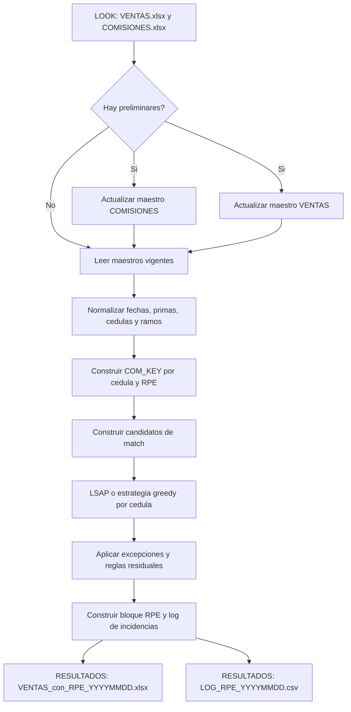

# Revision tecnica y funcional

## `bg_rpe_automatizacion_6865.py`

**Fecha de revision:** 2026-08-18  
**Alcance:** analisis estatico del script, de los archivos visibles del proyecto y de la configuracion local disponible.  
**No se ejecuto `main()`:** no se entregaron los Excel de entrada y la configuracion por defecto puede actualizar los maestros. Por tanto, los hallazgos de comportamiento se basan en el codigo y no constituyen una validacion de resultados contables con datos reales.

---

## Resumen ejecutivo

El script implementa una conciliacion de comisiones y ventas basada en archivos Excel. Primero puede actualizar los maestros `COMISIONES.xlsx` y `VENTAS.xlsx` a partir de archivos preliminares; despues normaliza datos, construye candidatos de cruce por cedula, fecha, prima y ramo, asigna RPE a ventas y genera una salida Excel para consumo operativo/Power BI junto con un CSV de incidencias.

La logica funcional es rica y muestra conocimiento del dominio: detecta encabezados y hojas por contenido, tolera formatos heterogeneos de fecha, numero y cedula, controla cancelaciones y maneja excepciones de negocio. Tambien incluye varias decisiones de rendimiento razonables: lectura selectiva de comisiones, modo `read_only`, caches, vectorizacion parcial, una ruta rapida para cedulas con una sola venta y asignacion optima mediante SciPy para grupos acotados.

El punto mas sensible no es el algoritmo de conciliacion sino la operacion sobre archivos: con la configuracion actual el proceso puede reemplazar ambos maestros, no crea realmente los backups que declara, reconstruye libros nuevos desde valores y realiza el reemplazo final mediante una copia no atomica. En un proceso de comisiones, ese riesgo debe resolverse antes de calendarizarlo sin supervision.

La evaluacion estatica lo ubica asi:

| Dimension | Evaluacion | Motivo principal |
|---|---|---|
| Cobertura funcional | Buena | Reglas de cruce, excepciones y salidas de auditoria estan implementadas. |
| Robustez frente a formatos Excel | Buena | Detecta hojas, encabezados y varios formatos de datos. |
| Seguridad operativa de archivos | Baja a media | Sobrescribe maestros sin backup efectivo ni reemplazo atomico. |
| Rendimiento | Medio | Tiene optimizaciones utiles, pero mantiene lecturas completas, cruces cartesianos por cedula y escritura Excel costosa. |
| Reproducibilidad | Baja | No hay manifiesto de dependencias, versiones fijadas ni pruebas locales visibles. |
| Mantenibilidad | Media a baja | Es un unico modulo de 2,884 lineas y 102 funciones; varios puntos criticos tienen alta complejidad. |

---

## Evidencia y limites de la revision

### Hechos comprobados

- El script tiene **2,884 lineas fisicas** y **102 funciones** definidas.
- Compila correctamente con `python -m py_compile` usando el Python local 3.13.
- En la carpeta analizada solo se observaron el script, un `README.md` sin documentacion real, `.gitignore` y `azure-pipelines.yml`.
- No se observaron `requirements.txt`, `pyproject.toml`, `Pipfile`, archivo Conda, pruebas unitarias ni fixtures de datos en el arbol visible.
- El script no importa clientes de red, bases de datos, ejecutores de shell ni SDKs cloud. Su integracion es exclusivamente con sistema de archivos Excel/CSV y variables de entorno.
- El propio encabezado del script solicita comparar una ejecucion R contra una Python con los mismos archivos antes de produccion, porque los empates de asignacion pueden variar.

### Aspectos no validados

- Calidad de los resultados contra archivos reales y contra la implementacion original en R.
- Volumen real de filas, distribucion de cedulas repetidas, tiempos de ejecucion y consumo de memoria.
- Permisos, retencion, cifrado y acceso a las carpetas compartidas de entrada y salida.
- Comportamiento del template externo usado por la canalizacion Azure DevOps.

---

## Funcion de negocio y flujo end-to-end

### Objetivo funcional

La finalidad es asociar cada venta de seguros con uno o dos RPE provenientes del maestro de comisiones. La asociacion busca conciliar prima, ramo y ventana temporal; despues entrega campos calculados de prima, comision, estado y excepciones para seguimiento operativo.



### Entradas, actualizaciones y salidas

| Artefacto | Ubicacion/configuracion | Uso observado |
|---|---|---|
| `VENTAS.xlsx` | `RPE_LOOK` + nombre fijo | Maestro de ventas. La hoja esperada es `BASE`, con deteccion alternativa de encabezados por contenido. |
| `COMISIONES.xlsx` | `RPE_LOOK` + nombre fijo | Maestro de RPE, primas y comisiones. La hoja esperada es `Base`. |
| `PRELIMINAR COMISIONES.xlsx` o variante con guion bajo | Carpeta `RPE_LOOK` | Opcional. Si existe y la bandera esta activa, reemplaza en el maestro el rango de fechas cubierto por el preliminar. |
| `PRELIMINAR VENTAS.xlsx` o variante con guion bajo | Carpeta `RPE_LOOK` | Opcional. Si existe y la bandera esta activa, incorpora ventas no presentes segun una llave derivada. |
| `VENTAS_con_RPE_YYYYMMDD.xlsx` | `RPE_RESULTADOS` | Copia plana reconstruida de ventas con un bloque RPE de 23 columnas desde `BN` hasta `CJ`. |
| `LOG_RPE_YYYYMMDD.csv` | `RPE_RESULTADOS` | Incidencias: sin RPE, anomalias, duplicados de grupo y excepciones de negocio. |

Las rutas se obtienen de `RPE_LOOK` y `RPE_RESULTADOS`. Si no existen esas variables, se usan rutas locales con el usuario `fplaza` incorporado en el codigo (lineas 72-79). Esto permite una ejecucion local, pero disminuye portabilidad y puede inducir a ejecutar contra una ubicacion equivocada.

### Actualizacion de maestros

#### Comisiones

`actualizar_archivo_comisiones()` (lineas 1193-1256) hace lo siguiente:

1. Detecta hoja y fila de encabezados del preliminar por contenido.
2. Lee maestro y preliminar; mapea alias de columnas y recalcula campos derivados.
3. Obtiene el minimo y maximo de `F EMISION` del preliminar.
4. Quita del maestro las filas dentro de ese rango temporal y concatena las filas del preliminar.
5. Si las llaves normalizadas de ambos conjuntos son iguales, evita reescribir.
6. Ordena por fecha de emision y escribe nuevamente `COMISIONES.xlsx`.

La semantica es **reemplazo por intervalo temporal**, no una fusion fila a fila. Es correcta solo si el preliminar contiene el universo completo y definitivo del rango que cubre.

#### Ventas

`actualizar_archivo_ventas()` (lineas 1516-1590) detecta el preliminar, mapea sus alias al encabezado del maestro, recalcula `CLAVE` y `10 DIGITOS`, valida columnas esenciales y agrega las filas cuya llave derivada no exista aun en el maestro. Tambien elimina filas consideradas mal cargadas cuando tienen producto, pero carecen simultaneamente de cedula, fecha, prima y clave.

La llave de ventas se forma con campos como cedula, fecha de ingreso, prima, producto, plan, ramo, credito, asegurado y codigo de cliente. Debe ser revisada con el negocio para confirmar que representa una identidad unica y estable de una venta.

---

## Reglas de conciliacion implementadas

### Normalizacion

Antes del cruce el script:

- Convierte cedulas a diez digitos, incluyendo valores numericos, notacion cientifica y algunos RUC de trece digitos.
- Convierte fechas Excel seriales, `YYYYMMDD`, ISO y variantes de `DD/MM/YYYY` o `MM/DD/YYYY`, gobernadas por `FECHA_DIA_PRIMERO`.
- Interpreta numeros con comas y puntos como separadores de miles o decimales.
- Normaliza nombres de columnas removiendo tildes, espacios y caracteres no alfanumericos para buscar alias.
- Obtiene un codigo de ramo desde `RAMO_MAP`; actualmente hay ocho ramos configurados.

### Construccion de `COM_KEY`

`build_com_key()` (lineas 1713-1764) agrupa comisiones por `(cedula10, rpe)` y obtiene:

- Fecha de emision minima y fin de vigencia maximo.
- Prima y subtotal agrupados; si existen campos de conjunto, privilegia su valor salvo ciertos casos de cero.
- Indicadores de prima negativa y de cancelacion posterior con el mismo RPE base.

### Match directo

Para una venta valida, un RPE candidato directo debe cumplir:

1. Tener la misma cedula de diez digitos.
2. No ser negativo ni estar marcado como cancelado.
3. Tener prima positiva y fecha de emision valida.
4. Estar entre la fecha de ingreso y la fecha de ingreso mas 11 meses.
5. Coincidir en codigo de ramo.
6. Satisfacer la tolerancia de prima:

$$
|\text{prima RPE} - \text{prima venta}| \leq \max(0.03 \times \text{prima venta}, 10)
$$

Cada RPE solo puede asignarse una vez dentro de la misma cedula.

### Seleccion de asignaciones

- Para cedulas pequenas, `solve_lsap()` usa `scipy.optimize.linear_sum_assignment`, un solucionador de asignacion bipartita. Esta es la alternativa de mejor costo global dentro del conjunto de candidatos construido.
- La ruta LSAP se limita a 220 filas de venta y 1,200 candidatos por cedula.
- Para grupos mayores, `solve_greedy()` aplica una seleccion greedy por escasez de candidatos y costo. Escala mejor, pero no garantiza el mismo optimo global que LSAP.
- Existe una ruta rapida para cedulas con una sola fila de venta. Evita construir y resolver la matriz LSAP completa cuando basta ordenar candidatos por costo.

El costo prioriza principalmente la diferencia de prima, seguido de antiguedad de reclamos sobre un mismo RPE, dias entre ingreso y emision, densidad de candidato y un desempate temporal. Los ordenamientos estables mejoran reproducibilidad, aunque el propio script reconoce que los empates pueden diferir frente a R.

### Reglas residuales y excepciones

Para ventas que no lograron una asignacion inicial se ejecutan, en orden, reglas especiales:

| Regla | Funcion | Resultado |
|---|---|---|
| Par principal + asistencia | `try_pair_asistencia()` | Combina un RPE del mismo ramo y otro de asistencia si la suma de primas concilia y la diferencia de emision no supera 10 dias. |
| Ajuste posterior parcial | `try_ajuste_posterior()` | `EXC_01_AJUSTE_POSTERIOR_PARCIAL`, con revision manual. |
| Cancelacion posterior total | `try_cancelado_posterior()` | `EXC_03_CANCELACION_POSTERIOR_TOTAL`, con revision manual. |
| Emision un dia antes del ingreso | `try_emision_antes_ingreso_1d()` | `EXC_04_EMISION_ANTES_INGRESO_1D`, con revision manual. |

`EXC_02_GRUPO_REPARTO_UNICO` esta declarado y se imprime en el resumen final, pero el comentario de codigo indica que se conserva del proceso R sin una funcion ni invocacion implementada. Por tanto su conteo sera siempre cero. Esto debe validarse con el area de negocio: puede ser una regla intencionalmente descartada o una capacidad funcional faltante.

Cuando el ramo de una venta no esta en `RAMO_MAP`, el script puede hacer match sin validar el prefijo de ramo del RPE y deja una anomalia registrada. Es una decision explicita que evita perder matches, pero amerita control manual y una politica de negocio documentada.

---

## Dependencias

### Dependencias de ejecucion

| Paquete/modulo | Tipo | Uso comprobado | Estado en el Python local |
|---|---|---|---|
| `numpy` | PyPI, requerido | Arrays, NaN, operaciones vectorizadas y matriz de costos. | No instalado. |
| `pandas` | PyPI, requerido | DataFrames, agrupaciones, conversiones, merges y salida CSV. | No instalado. |
| `openpyxl` | PyPI, requerido | Lectura/escritura Excel, formatos y estilos. | No instalado. |
| `scipy` | PyPI, requerido | `linear_sum_assignment` para el match LSAP. | No instalado. |
| `python-dateutil` | PyPI, requerido | `relativedelta` para sumar meses. | Instalado: `2.9.0.post0`. |
| `python-calamine` | PyPI, opcional | Lector Rust para Excel; el codigo hace fallback a `openpyxl`. | No instalado. |
| `os`, `re`, `math`, `shutil`, `tempfile`, `warnings`, `unicodedata`, `datetime` | Biblioteca estandar | Sistema de archivos, parseo y manejo de datos. | Incluidos con Python. |

El comentario de cabecera declara correctamente `pandas`, `numpy`, `openpyxl`, `scipy` y `python-dateutil`. Sin embargo, falta un manifiesto instalable y versionado. No hay forma reproducible, dentro del proyecto, de reconstruir el entorno de ejecucion.

La comprobacion local de imports confirma que el entorno actual solo tiene `dateutil`; esto no demuestra que produccion este incompleta, pero si demuestra que el proyecto no porta por si mismo las dependencias necesarias. El analisis de Pylance tambien marca como no resueltas las dependencias externas en el entorno seleccionado.

### Dependencias privadas o internas

No se encontraron imports de paquetes Python privados, modulos propios externos ni SDKs corporativos dentro del script. `Tbl`, los mapas de aliases y los helpers son codigo local del mismo archivo, no dependencias privadas distribuibles.

La canalizacion Azure DevOps si referencia el repositorio compartido `cdo-pipeline-templates/pipeline-templates-for-ocp` y varios grupos de variables corporativos. Esa es una dependencia de CI/CD externa al script; su contenido, instalacion de paquetes y comportamiento no estaban disponibles para esta revision.

### Limpieza de imports y codigo inactivo

El diagnostico estatico encontro estos elementos sin uso:

- `time` importado en linea 35.
- El import de modulo `openpyxl` en linea 46; los simbolos importados directamente si se usan.
- La variable local `h` en `recalcular_columnas_comisiones()`.
- La variable local `common_norm` en `copy_ventas_preliminar_a_master()`.
- `HACER_BACKUP_COMISIONES`, `HACER_BACKUP_VENTAS` y `ventas_row_ini` se declaran pero no controlan comportamiento efectivo.

No son fallos funcionales por si solos, pero dan senales de configuracion incompleta y aumentan el costo de mantenimiento.

---

## Evaluacion de rendimiento

### Optimizaciones ya presentes

| Mecanismo | Valor | Observacion |
|---|---|---|
| Lectura ligera de comisiones | Alto | `build_com_for_match_light()` carga solo las columnas necesarias para el cruce cuando no se actualizo el maestro en memoria. |
| `openpyxl` en `read_only=True` | Alto | Reduce memoria frente a cargar el libro completo por defecto. |
| `python-calamine` opcional | Potencialmente alto | El codigo intenta usar un lector mas rapido y hace fallback compatible. |
| Cache de lecturas Calamine | Medio | Evita algunas relecturas del mismo archivo/hoja durante una ejecucion. |
| Cache de suma de meses | Medio | Reduce conversiones repetidas para fechas repetidas. |
| Vectorizacion parcial | Medio | Filtros y costos de candidatos usan operaciones pandas/numpy. |
| Agrupacion por cedula | Alto | Evita un producto cartesiano global entre todas las ventas y todas las comisiones. |
| Fast path para una venta | Alto para datos usuales | Evita LSAP por cedula si solo hay una fila de venta. |
| Umbrales LSAP | Alto | Evitan resolver matrices demasiado grandes con el algoritmo exacto. |

### Cuellos de botella comprobables

#### 1. Calamine lee hojas completas incluso para operaciones de cabecera

`_calamine_read_all()` ejecuta `ws.to_python(skip_empty_area=False)` y cachea la hoja completa (lineas 601-615). `read_top_rows()` la utiliza cuando Calamine esta disponible, aunque solo necesite las primeras filas para detectar hoja o encabezado.

Esto puede contradecir el objetivo de las funciones `read_top_rows()` y `read_sheet_to_tbl()`: un archivo muy grande puede cargarse completo varias veces, con costo de memoria proporcional al total de celdas. La cache evita algunas relecturas, pero tambien conserva en memoria listas completas de celdas.

**Mejora recomendada:** separar una lectura realmente acotada para deteccion de hoja/encabezado, imponer un limite de memoria o de entradas con LRU y medir el backend usado en cada ejecucion. Antes de modificar, confirmar si la API de Calamine permite lectura parcial; si no, usar el camino streaming de `openpyxl` para esas fases pequenas.

#### 2. Cruce cartesiano por cedula antes de aplicar limites LSAP

`build_single_edges_one_cedula()` crea un producto cartesiano entre las ventas y candidatos de una cedula mediante una clave temporal `_k` (lineas 1923-1977). Su costo temporal y de memoria inicial es aproximadamente:

$$
O(V_c \times C_c)
$$

donde $V_c$ son las ventas y $C_c$ los RPE de esa cedula. Los umbrales de LSAP se aplican despues de construir las aristas. Por ello, una cedula atipica con muchas ventas y muchos RPE puede agotar memoria o tardar mucho incluso si luego usa la estrategia greedy.

**Mejora recomendada:** filtrar candidatos por ramo y ventana de fechas antes del producto cartesiano, procesar por bloques, incorporar indices/llaves intermedias y registrar el maximo de aristas por cedula. No cambiar el orden de reglas sin una prueba de paridad contra R.

#### 3. Escritura Excel fila a fila y reconstruccion completa

`escribir_master_xlsx()` y `escribir_salida()` crean un `Workbook()` nuevo, agregan todas las filas y aplican formatos celda por celda. `escribir_salida()` tiene 194 lineas y una puntuacion estatica de ramas de 66; ademas recorre las filas varias veces para colorear resultados.

Este enfoque sera costoso para archivos grandes. Tambien obliga a cargar toda la salida en memoria antes de grabarla.

**Mejora recomendada:** perfilar primero. Para una salida plana, evaluar un escritor streaming o `xlsxwriter`; para conservar un libro existente, modificar una copia del libro original solo si se requiere preservar formulas/estilos. La opcion correcta depende del contrato de salida.

#### 4. Parseos escalares sobre Series

Funciones como `parse_fecha()`, `to_num()` y `clean_cedula10()` aplican un helper Python por elemento. Esto maximiza tolerancia a formatos heterogeneos, pero puede ser dominante en archivos muy grandes.

**Mejora recomendada:** mantener el parser robusto como fallback y medir una ruta vectorizada para formatos frecuentes. No reemplazarlo de forma ciega, porque la tolerancia a archivos reales parece una necesidad del negocio.

### Juicio de optimizacion

El script **no puede calificarse como optimo de forma absoluta** sin un perfil con datos reales. Para volumen moderado y una distribucion donde la mayoria de cedulas tiene una sola venta, el diseno contiene optimizaciones pertinentes. Para archivos muy grandes, cedulas atipicas o ejecuciones recurrentes, la lectura completa por Calamine, el producto cartesiano por cedula y la escritura Excel completa son riesgos claros de escalabilidad.

Las metricas minimas que deberian recogerse por ejecucion son: tamano de archivos, filas leidas, backend Excel usado, tiempo por fase, maximo de filas/RPE/aristas por cedula, numero de grupos que pasaron a greedy, memoria maxima y numero de resultados por tipo de excepcion.

---

## Riesgos de integridad, operacion y seguridad

### 1. Reemplazo destructivo de maestros sin backup efectivo

**Severidad: alta.**

Las banderas `HACER_BACKUP_COMISIONES` y `HACER_BACKUP_VENTAS` se declaran en lineas 96-97 pero no se consultan en el resto del codigo. Al mismo tiempo, ambas actualizaciones estan activadas por defecto. `escribir_master_xlsx()` valida un archivo temporal, pero despues usa `shutil.copy(tmp.name, path)` para sobrescribir el destino (linea 1153).

Consecuencias:

- No existe copia de recuperacion creada por el script.
- El reemplazo no es atomico: una interrupcion mientras se copia puede dejar el maestro truncado o inconsistente.
- `BORRAR_BACKUPS_VENTAS_EXISTENTES=True` intenta borrar archivos coincidentes y silencia errores, aunque el codigo no cree esos backups.

**Accion requerida:** implementar backup con nombre unico y checksum, validar conteos y estructura antes de publicar, usar `os.replace()` sobre un archivo temporal en el mismo volumen y conservar una estrategia de rollback. Como medida inmediata, desactivar la actualizacion de maestros por defecto y exigir una opcion explicita de ejecucion.

### 2. Los libros maestros se reconstruyen y pierden artefactos no representados como valores

**Severidad: alta si los maestros contienen formulas, macros, hojas auxiliares o formato relevante.**

Las lecturas se hacen con `data_only=True` y las escrituras crean un `Workbook()` nuevo (lineas 1072 y 2703). Por diseno, el archivo resultante conserva datos y un formato generico generado por el script, pero no el libro original completo.

Posibles perdidas al reemplazar un maestro:

- Formulas, pues se leen sus valores cacheados.
- Hojas distintas de la hoja procesada.
- Macros, tablas, validaciones, filtros, formatos condicionales, anchos, alturas, comentarios, imagenes y metadatos del libro original.

Esto debe convertirse en un contrato explicito. Si el maestro se considera una tabla plana, documentarlo y probarlo. Si es un documento Excel rico, la estrategia de escritura debe preservar la estructura original.

### 3. Colision de nombres de salida en ejecuciones del mismo dia

**Severidad: media.**

Las dos salidas se nombran solamente con `YYYYMMDD` (lineas 2792 y 2798). Dos ejecuciones en el mismo dia sobrescriben el archivo anterior sin pedir confirmacion ni almacenar un identificador de corrida.

**Accion requerida:** incluir fecha-hora, identificador de ejecucion o version; registrar hash de entradas y mantener una carpeta por corrida.

### 4. Advertencias y excepciones amplias se silencian

**Severidad: media.**

El script aplica `warnings.filterwarnings("ignore")` globalmente (linea 62). Ademas usa varios `except Exception`, especialmente para cambiar de Calamine a `openpyxl`. El fallback es valioso, pero actualmente puede ocultar la causa de una degradacion de rendimiento o de una lectura fallida.

**Accion requerida:** usar `logging`, registrar excepcion y backend seleccionado, capturar tipos especificos cuando sea posible y no silenciar advertencias fuera de las que se justifiquen de forma precisa.

### 5. Datos personales en entradas, salidas y log

**Severidad: alta desde privacidad/operacion.**

El flujo procesa cedula, nombres, email, telefono, datos de venta, primas y comisiones. El CSV de log conserva cedula cruda, importes y detalles de excepcion. No se detectaron secretos incrustados ni comunicaciones de red, pero el codigo tampoco impone controles sobre las carpetas o la retencion de los archivos.

**Accion requerida:** restringir ACL de `LOOK` y `RESULTADOS`, definir retencion, proteger copias de respaldo, evitar compartir logs sin necesidad y evaluar cifrado en reposo conforme a las politicas aplicables.

### 6. Rutas y reglas de negocio estan en codigo

**Severidad: media.**

Rutas de fallback, nombres de archivo, hojas, letras de columna, tolerancias, limites de LSAP y reglas de excepcion estan concentrados al inicio del script. Esa concentracion es una fortaleza, pero los cambios siguen requiriendo editar y desplegar codigo.

**Accion requerida:** mover configuracion operativa a un archivo versionado o parametros CLI, validar el esquema de configuracion y guardar una copia de la configuracion junto a cada corrida.

---

## Calidad y mantenibilidad

### Puntos positivos

- Los nombres de funciones y secciones son mayormente expresivos.
- La cabecera explica procedencia, dependencias, entradas y necesidad de validar frente a R.
- La deteccion por contenido reduce fragilidad frente a cambios de nombres de hoja o fila de encabezado.
- Los resultados distinguen match correcto, sin RPE, grupo duplicado y excepcion manual mediante `dictamen_color_powerbi`.
- Las funciones de parseo estan concentradas y son reutilizables.

### Puntos a mejorar

| Hallazgo | Evidencia | Impacto |
|---|---|---|
| Monolito de responsabilidad multiple | Un archivo realiza configuracion, lectura, actualizacion, dominio de conciliacion, reportes y escritura. | Las pruebas y cambios tienen radio de impacto alto. |
| Funciones complejas | `escribir_salida`: 194 lineas/puntuacion 66; `leer_ventas_para_match`: 99/45; `build_com_for_match_light`: 85/38; `ejecutar_match`: 96/32. | Dificulta entender, probar y modificar rutas criticas. |
| Sin tipado explicito | Las 102 funciones no exponen contratos de tipo. | Menor ayuda del IDE y mayor riesgo de errores de DataFrame/None. |
| Estado global | Configuracion, caches y rutas se resuelven al importar el modulo. | Complica pruebas aisladas, configuraciones por corrida y ejecucion concurrente. |
| `Tbl` minimo | La clase solo agrupa `headers` y `df`. | Un `@dataclass` tipado y validado haria explicito su contrato. |
| Sin pruebas visibles | No hay directorio de pruebas ni casos de regresion. | No se puede demostrar paridad R/Python ni proteger cambios de tolerancias. |
| README de plantilla | No documenta instalacion, ejecucion, entradas, salidas ni recuperacion. | El conocimiento operativo queda dentro del codigo. |

La canalizacion Azure declara un parametro de pruebas unitarias habilitado por defecto, pero el template que materializa esa etapa es externo y no hay pruebas locales visibles. La intencion de CI no sustituye evidencia de pruebas ejecutables dentro del repositorio.

---

## Hallazgos priorizados

| Prioridad | Hallazgo | Riesgo | Recomendacion concreta |
|---|---|---|---|
| P0 | Sobrescritura de maestros sin backup efectivo ni publicacion atomica. | Perdida o corrupcion de datos de comisiones/ventas. | Implementar backup real, validacion post-escritura, `os.replace()` y rollback; requerir flag explicito para mutar maestros. |
| P0 | No hay suite de regresion ni comparacion automatizada con la salida R. | Un cambio puede alterar conciliaciones financieras sin detectarse. | Crear casos golden anonimizados y comparar filas, RPE, importes, excepciones y logs contra R. |
| P1 | Falta manifiesto de dependencias y versiones compatibles. | El proyecto no es reproducible; el entorno local no puede ejecutarlo. | Crear `pyproject.toml` o `requirements.txt` a partir de un entorno validado, fijar versiones y documentar Python soportado. |
| P1 | Reconstruccion plana de libros al actualizar maestros. | Perdida de formulas, hojas y metadatos Excel. | Definir contrato de libro plano o cambiar la estrategia para preservar artefactos necesarios. |
| P1 | Producto cartesiano por cedula antes del fallback greedy. | Picos de memoria/tiempo con cedulas grandes. | Pre-filtrar y particionar candidatos; medir aristas por cedula y establecer limites operativos. |
| P1 | Calamine carga hojas completas para leer encabezados. | Memoria innecesaria y posible degradacion en archivos grandes. | Usar lectura parcial/streaming para inspeccion de cabeceras y cache con limite de memoria. |
| P1 | `EXC_02` esta declarada pero no implementada. | Posible regla de negocio ausente y conteo engañosamente siempre cero. | Confirmar con negocio si se retira, implementa o se marca claramente como no aplicable. |
| P1 | Archivos de salida se sobrescriben dentro del mismo dia. | Se pierde trazabilidad de corridas. | Incluir fecha-hora/UUID, manifiesto de corrida y hashes de entrada. |
| P2 | Advertencias globalmente ignoradas y excepciones amplias. | Diagnostico insuficiente y fallos silenciosos. | Logging estructurado, excepciones especificas y resumen de calidad de entrada. |
| P2 | Datos personales en CSV/Excel sin controles en codigo. | Exposicion de PII y datos financieros. | ACL, retencion, cifrado y minimizacion de campos en logs compartidos. |
| P2 | Tolerancias y rutas en constantes globales. | Cambios operativos requieren editar codigo. | Configuracion validada por archivo/CLI y registro de parametros por corrida. |
| P3 | Imports, variables y flags sin uso. | Ruido y falsa expectativa operativa. | Eliminar codigo muerto o implementar las banderas prometidas. |

---

## Hoja de ruta recomendada

### Fase 1: proteger la operacion antes de automatizar

1. Cambiar el modo por defecto a solo lectura o `--dry-run`; requerir una opcion explicita para actualizar maestros.
2. Implementar backup real por cada maestro con fecha-hora, checksum y politica de retencion.
3. Publicar cambios mediante archivo temporal en el mismo directorio y `os.replace()`; validar que el archivo final se puede reabrir.
4. Generar nombres unicos de salida y un manifiesto JSON/CSV de corrida con entradas, hashes, configuracion y conteos.
5. Definir y probar si los maestros pueden ser libros planos o si deben preservar formulas y hojas auxiliares.

### Fase 2: hacer el proceso reproducible y verificable

1. Crear un manifiesto de dependencias desde un entorno que haya sido validado contra R; no adivinar versiones.
2. Documentar instalacion, variables de entorno, estructura esperada de Excel, permisos, ejecucion y recuperacion en el README.
3. Crear fixtures anonimizados y pruebas para fechas, importes, cedulas, alias, deteccion de encabezados y llaves de deduplicacion.
4. Crear pruebas golden para match directo, asistencia, ajuste posterior, cancelacion, emision previa, ramo no mapeado y grupos duplicados.
5. Convertir la comparacion R/Python en una prueba de regresion aprobada por negocio.

### Fase 3: medir y optimizar con datos reales anonimizados

1. Instrumentar tiempos y volumenes por fase.
2. Confirmar cuantos grupos usan fast path, LSAP y greedy.
3. Reducir el producto cartesiano con filtros previos por ramo, fecha y rango de prima.
4. Ajustar la lectura Calamine para no cargar libros completos durante la deteccion de cabeceras.
5. Evaluar la estrategia de escritura Excel segun el contrato de preservacion de formato y el volumen real.

### Fase 4: modularizar sin cambiar reglas de negocio

Una separacion conservadora podria ser:

```text
src/
  config.py          # parametros y validacion de entorno
  excel_io.py        # lectura, deteccion y escritura
  normalization.py   # fechas, numeros, cedulas y encabezados
  master_updates.py  # actualizacion transaccional de maestros
  matching.py        # COM_KEY, LSAP, greedy y excepciones
  reporting.py       # bloque RPE, log y manifiesto de corrida
  main.py            # CLI y orquestacion
tests/
  test_normalization.py
  test_matching_golden.py
  test_master_updates.py
```

La primera extraccion debe ser sin cambio de comportamiento y protegida por pruebas golden. La prioridad no es introducir una arquitectura nueva, sino hacer comprobables las reglas actuales.

---

## Plan de validacion antes de produccion

1. Ejecutar R y Python sobre el mismo conjunto de archivos anonimizados y comparar cada fila: RPE principal/secundario, primas, comision, dictamen, excepcion y log.
2. Probar explicitamente empates de costo para confirmar la politica aceptada de desempate.
3. Probar con libros que contengan formulas, varias hojas y formatos relevantes para decidir si la reconstruccion actual es aceptable.
4. Ejecutar una prueba de falla durante publicacion de maestro y verificar que el original se conserva y que existe rollback.
5. Ejecutar cargas pequena, media y maxima esperada; medir memoria, tiempo de lectura, tiempo de match, tiempo de escritura y cantidad de aristas por cedula.
6. Validar accesos y retencion de los archivos con el responsable de seguridad/datos.
7. Acordar con negocio el estado esperado de `EXC_02` y de los matches con ramo no mapeado.

---

## Validaciones realizadas durante esta revision

| Validacion | Resultado |
|---|---|
| Compilacion sintactica de `bg_rpe_automatizacion_6865.py` | Exitosa con Python 3.13. |
| Inventario AST | 102 funciones; mayores focos de complejidad identificados. |
| Auditoria de imports | Dependencias PyPI y elementos sin uso identificados. |
| Prueba de imports en el Python local | Solo `dateutil` esta disponible; faltan `numpy`, `pandas`, `openpyxl`, `scipy` y `python-calamine`. |
| `pip check` | Sin conflictos entre paquetes instalados; no valida paquetes que no estan instalados. |
| Revision de CI | Existe una canalizacion que delega en un template Python externo; no hay manifiesto ni pruebas locales visibles. |
| Ejecucion funcional | No realizada por ausencia de Excel de entrada y para evitar actualizar maestros. |

---

## Conclusion

El script es una base funcionalmente madura para conciliacion de comisiones: sus reglas de match y tolerancia a variaciones de Excel son fortalezas claras. La siguiente mejora no deberia ser cambiar el algoritmo de negocio; deberia ser volver segura y verificable la operacion alrededor del algoritmo.

Antes de una calendarizacion productiva se recomienda resolver, como minimo, el reemplazo transaccional con backup real, la reproducibilidad de dependencias, una bateria de regresion R/Python y la preservacion o contractualizacion de los libros Excel. Con esas bases, las optimizaciones de lectura, candidatos y escritura podran hacerse con metricas y sin poner en riesgo la conciliacion actual.